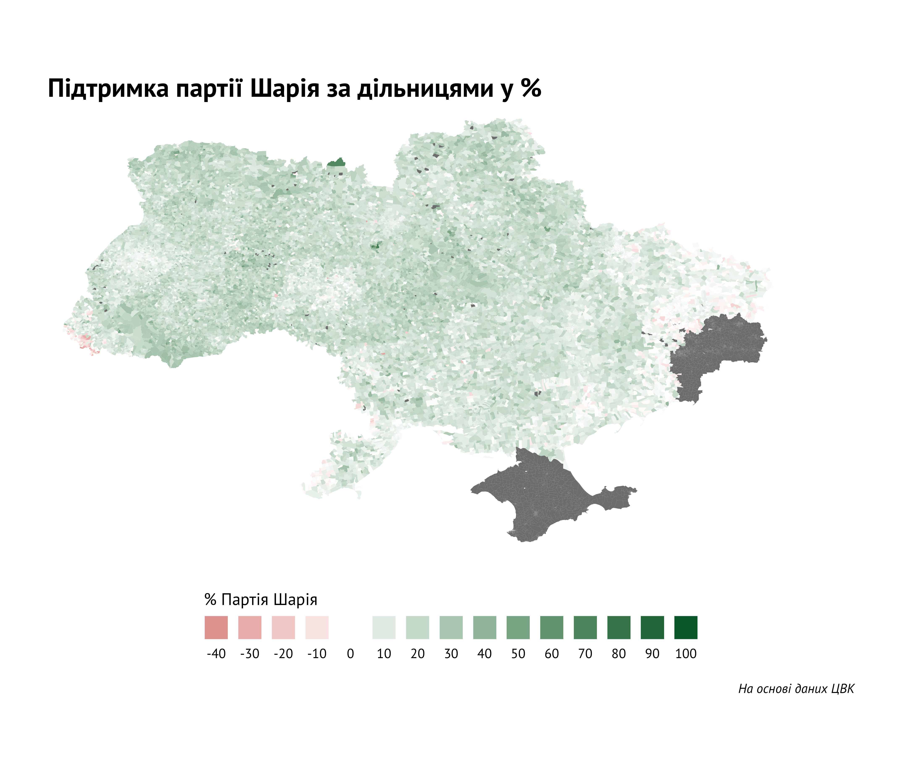

# Ukrainian elections analysis

- **analysis** - зошити з аналізом даних по виборах:
  - **[висхідний файл з аналізом зв'язку між 4G і голосуванням на парламентських виборах 21 липня 2019 року в Україні](analysis/4g_influence.Rmd)**
  - **[вихідний файл з аналізом зв'язку між 4G і голосуванням на парламентських виборах 21 липня 2019 року в Україні](analysis/4g_influence.md)** 
  - **[висхідний файл з аналізом голосування за партію "Слуга народу" і мажоритарних кандидатів від неї](analysis/majors_mutanty.Rmd)**
  - **[вихідний файл з аналізом голосування за партію "Слуга народу" і мажоритарних кандидатів від неї](analysis/majors_mutanty.md)** 
  - **[висхідний файл з аналізом перетоків голосів на президентських і парламентських виборах](analysis/flows.Rmd)**
  - **[вихідний файл з аналізом перетоків голосів на президентських і парламентських виборах](analysis/flows.md)** 
- **polit_flow.R** - код для аналізу перетоків голосів на президентських і парламентських виборах і їх візуалізації
- **data** - збережені файли з даними:
  - **[shapefile з полігонами округів](data/ovk)** - взято [тут](https://www.arcgis.com/home/item.html?id=121fc5fc6b8449329f21d1459768de37)
  - **[Координати меж виборчих дільниць](data/cordynaty_VD.csv)** - взяти з репозиторію ОПОРИ
  - **[Координати полігонів з 4G від Київстар](data/kyivstar-4g.kmz)** - взято [тут](https://www.mobua.net/kmzmaps/kyivstar-4g.kmz)
  - **[Координати полігонів з 4G від Lifecell](data/lte_w29_11.kmz)**  - взято з їх [офіційного сайту](https://lifecell.ua/uploads/coverage_maps/lte_w29_11.kmz)
  - **[Координати полігонів з 4G від Vodafone](data/4g_38.kmz)** - взято з їх [офіційного сайту](https://www.vodafone.ua/4g/4g_38.kmz?5)
  - **[Файл з полігонами дільниць](data/poly_dil.rds)** - створено на основі файлу з **[координатами меж виборчих дільниць](data/cordynaty_VD.csv)**
  - **[Рівень покриття 4G за дільницею](data/4g_internet_by_vd.fst)** - процес його створення міститься у файлі [тут](scripts/data_collecting.R)
  - **[Дані голосування на парламентських виборах 21 липня 2019 року в Україні за дільницями (списки)](data/parlament_election_2019_by_vd.fst)** - зіскраплено з сайту ЦВК
  - **[Дані голосування на парламентських виборах 21 липня 2019 року в Україні за дільницями (мажоритарка)](data/parlament_election_2019_by_vd_major.fst)** - зіскраплено з сайту ЦВК
  - **[Дані про мажоритарних кандидатів на парламентських виборах 21 липня 2019 року в Україні](data/parlament_election_2019_major_info.fst)** - зіскраплено з сайту ЦВК
  - **[Дані голосування на президентських виборах 31 березня 2019 року (1 тур) в Україні за дільницями](data/president_election_2019_1_by_vd.fst)** - зіскраплено з сайту ЦВК
  - **[Дані голосування на президентський виборах 21 квітня 2019 року (2 тур) в Україні за дільницями](data/president_election_2019_2_by_vd.fst)** - зіскраплено з сайту ЦВК
- **plots** - папка з графіками:
  - 4G пенетрація в розрізі виборчих дільниць
  
  - вплив 4G на голосування
  
  - голосування за партію Шарія у розрізі виборчих дільниць
  
  - різниця в результаті партії Слуга народу на окрузі і мажоритарника від неї
  
  - Топ-10 мажоритарників, які перемогли на окрузі з великою підтримкою "Слуги народу"
  
  - Приріст голосів за "Слугу народу" порівняно з результатом Володимира Зеленського в 1 турі президентських виборів
  
  - Явка на парламентських виборах 21 липня 2019 року порівняно з першим туром президентських виборів 31 березня 2019 року
  
  - Перетоки голосів з першого туру президентських виборів у другому турі
  
  - Перетоки голосів з першого туру президентських виборів на парламентських виборах
  
  - Перетоки голосів з другого туру президентських виборів на парламентських виборах
  
- **scripts** - папка з скріптами для збору, підготовки і аналізу даних:
  -**[скріпт для збору даних з сайту ЦВК та сайтів телеком операторів](scripts/data_collecting.R)**
  
Публікації на основі досліджень з цього репозиторію:

- [Перетоки голосів на виборах: як з'явилися та куди поділися 25% Порошенка](https://rubryka.com/article/peretoky-golosiv-vybory/)
- [Ті, хто встояв перед зеленим цунамі: топ-10 мажоритарників, які виграли в округах з великою підтримкою "Слуги народу"](https://rubryka.com/article/ti-hto-vstoyav-pered-zelenym-tsunami/)
- [4G і виборці. Як покриття LTE вплинуло на склад українського парламенту](https://rubryka.com/article/4g-ukraine-elections-mobile/)
- [Гіпотеза: виборці Порошенка у 2014 = виборці Зеленського у 2019. Перевірили статистично](https://rubryka.com/article/infograph-poroshenko-2014-zelenskiy-2019/)
- [Аномалії на Донбасі: карта коливань голосів у першому і другому турі виборів](https://rubryka.com/article/infographics-results-election-2019/)
- [Хто стане президентом України, може сказати одне місто. Дослідили, яке](https://rubryka.com/article/hto-stane-presidentom-sociology/)
