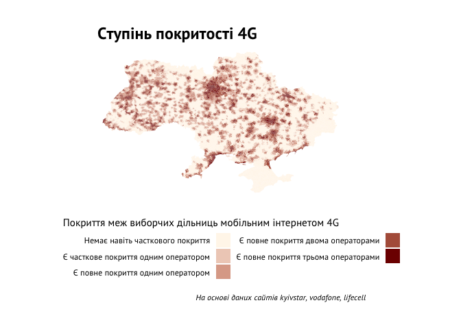

Про вплив інтернет-технологій на виборах цього року не говорив тільки
лінивий експерт.

Діджитал-кампанія Володимира Зеленського, армія прихильників Петра
Порошенка у Фейсбуці, блоги Анатолія Шарія та Дмитра Гордона на Ютубі -
це все точно впливало на кампанії, що навіть старожили української
політики, на зразок Юлії Тимошенко, почали все активніше освоювати такі
майданчики як Ютуб та Інстаграм.

При цьому Україна ще точно не є на 100% інтернетизованою країною, хоч
частка користувачів мережі постійно зростає. Останні роки цьому сприяє
поява та розширення стандартів мобільного інтрнету 3G та 4G (LTE).
Останній стандарт зв’язку для нас особливо цікавий, адже саме він
дозволяє без проблем їдучи в маршрутці на роботу подивися свіжий блог
Шарія, чи смакуючи шаурмою біля зупинки - новий сторіс Володимира
Зеленського.

4G зв’язок в Україні
--------------------

4G покриття в Україні забезпечують 3 основні телеком оператори -
Київстар, Водафон та Лайфсел. На їх офіційних сайтах можна знайти
інформацію про покриття, що я і зробив. Поті ці дані було використано
для того, аби зв’ясувати, наскільки межі кожної дільниці в Україні є
покриті 4G-зв’язком. Технічні деталі можна знайти в
[репозиторії](https://github.com/RomanKyrychenko/ukrainian_elections).

На карті можна побачити, яка ситуація з покриттям на усіх дільницях.

В зоні хорошого покриття 4G живе майже половина проголосувавших на
виборах (близько 48% або майже 7 млн виборців). Там, де нема навіть
натяку на 4G живе близько 11% виборців (або майже 1.6 млн). Інші виборці
проживають у межах дільниць, де покриття тільки часткове і надається не
всіма операторами. Схоже, що вплив інтрнету на виборців уже має бути
дуже відчутним, так як ми при цьому не можемо врахувати вплив провідного
інтернету (відсутні настільки деталізовані дані).

Як би голосували
----------------

Отже, наявність 4G дійсно пов’язана з прихильністю до певних політичних
сил.

<!--html_preserve-->

<!--gt table start-->
<table class="gt_table">
<thead>
<tr>
<th colspan="6" class="gt_heading gt_title gt_font_normal gt_center">
Як якість покриття 4G пов’язана з голосуванням на парламентських
виборах?
</th>
</tr>
<tr>
<th colspan="6" class="gt_heading gt_subtitle gt_font_normal gt_center gt_bottom_border">
Розподіли голосів виборців в залежності від покриття меж їх дільниці 4G
</th>
</tr>
</thead>
<tr>
<th class="gt_col_heading gt_left" rowspan="1" colspan="1">
Партія
</th>
<th class="gt_col_heading gt_right" rowspan="1" colspan="1">
Є повне покриття трьома операторами
</th>
<th class="gt_col_heading gt_right" rowspan="1" colspan="1">
Є повне покриття двома операторами
</th>
<th class="gt_col_heading gt_right" rowspan="1" colspan="1">
Є повне покриття одним оператором
</th>
<th class="gt_col_heading gt_right" rowspan="1" colspan="1">
Є часткове покриття одним оператором
</th>
<th class="gt_col_heading gt_right" rowspan="1" colspan="1">
Немає навіть часткового покриття
</th>
</tr>
<tbody class="gt_table_body">
<tr>
<td class="gt_row gt_left" style="background-color:white;">

</td>
<td class="gt_row gt_right" style="background-color:#95353B;color:#FFFFFFFF;">
42.77%
</td>
<td class="gt_row gt_right" style="background-color:#8F2A35;color:#FFFFFFFF;">
44.79%
</td>
<td class="gt_row gt_right" style="background-color:#922F37;color:#FFFFFFFF;">
43.95%
</td>
<td class="gt_row gt_right" style="background-color:#933139;color:#FFFFFFFF;">
43.44%
</td>
<td class="gt_row gt_right" style="background-color:#993B3E;color:#FFFFFFFF;">
41.55%
</td>
</tr>
<tr>
<td class="gt_row gt_left gt_striped" style="background-color:white;">

</td>
<td class="gt_row gt_right gt_striped" style="background-color:#E1BE9A;color:#000000FF;">
13.59%
</td>
<td class="gt_row gt_right gt_striped" style="background-color:#E1BD9A;color:#000000FF;">
13.66%
</td>
<td class="gt_row gt_right gt_striped" style="background-color:#E5C7A2;color:#000000FF;">
11.57%
</td>
<td class="gt_row gt_right gt_striped" style="background-color:#E5C6A1;color:#000000FF;">
11.78%
</td>
<td class="gt_row gt_right gt_striped" style="background-color:#E0BC99;color:#000000FF;">
13.89%
</td>
</tr>
<tr>
<td class="gt_row gt_left" style="background-color:white;">

</td>
<td class="gt_row gt_right" style="background-color:#EAD0A8;color:#000000FF;">
9.76%
</td>
<td class="gt_row gt_right" style="background-color:#EFDBB1;color:#000000FF;">
7.36%
</td>
<td class="gt_row gt_right" style="background-color:#F1DFB3;color:#000000FF;">
6.66%
</td>
<td class="gt_row gt_right" style="background-color:#F2E2B6;color:#000000FF;">
5.91%
</td>
<td class="gt_row gt_right" style="background-color:#F3E3B7;color:#000000FF;">
5.74%
</td>
</tr>
<tr>
<td class="gt_row gt_left gt_striped" style="background-color:white;">

</td>
<td class="gt_row gt_right gt_striped" style="background-color:#F0DDB2;color:#000000FF;">
6.95%
</td>
<td class="gt_row gt_right gt_striped" style="background-color:#F2E2B6;color:#000000FF;">
6.05%
</td>
<td class="gt_row gt_right gt_striped" style="background-color:#F4E6B9;color:#000000FF;">
5.22%
</td>
<td class="gt_row gt_right gt_striped" style="background-color:#F7ECBD;color:#000000FF;">
3.92%
</td>
<td class="gt_row gt_right gt_striped" style="background-color:#F8EFC0;color:#000000FF;">
3.26%
</td>
</tr>
<tr>
<td class="gt_row gt_left" style="background-color:white;">

</td>
<td class="gt_row gt_right" style="background-color:#F1DFB4;color:#000000FF;">
6.58%
</td>
<td class="gt_row gt_right" style="background-color:#EED9AF;color:#000000FF;">
7.82%
</td>
<td class="gt_row gt_right" style="background-color:#EAD0A8;color:#000000FF;">
9.79%
</td>
<td class="gt_row gt_right" style="background-color:#E8CBA5;color:#000000FF;">
10.69%
</td>
<td class="gt_row gt_right" style="background-color:#E7CBA4;color:#000000FF;">
10.79%
</td>
</tr>
<tr>
<td class="gt_row gt_left gt_striped" style="background-color:white;">

</td>
<td class="gt_row gt_right gt_striped" style="background-color:#F6EABC;color:#000000FF;">
4.37%
</td>
<td class="gt_row gt_right gt_striped" style="background-color:#F7EDBE;color:#000000FF;">
3.68%
</td>
<td class="gt_row gt_right gt_striped" style="background-color:#F8EEBF;color:#000000FF;">
3.47%
</td>
<td class="gt_row gt_right gt_striped" style="background-color:#F8F0C0;color:#000000FF;">
3.17%
</td>
<td class="gt_row gt_right gt_striped" style="background-color:#F9F1C1;color:#000000FF;">
2.85%
</td>
</tr>
<tr>
<td class="gt_row gt_left" style="background-color:white;">

</td>
<td class="gt_row gt_right" style="background-color:#F8EFC0;color:#000000FF;">
3.32%
</td>
<td class="gt_row gt_right" style="background-color:#F9F0C1;color:#000000FF;">
3.04%
</td>
<td class="gt_row gt_right" style="background-color:#FAF3C3;color:#000000FF;">
2.46%
</td>
<td class="gt_row gt_right" style="background-color:#F9F2C2;color:#000000FF;">
2.68%
</td>
<td class="gt_row gt_right" style="background-color:#F9F1C1;color:#000000FF;">
2.88%
</td>
</tr>
<tr>
<td class="gt_row gt_left gt_striped" style="background-color:white;">

</td>
<td class="gt_row gt_right gt_striped" style="background-color:#F8EFC0;color:#000000FF;">
3.25%
</td>
<td class="gt_row gt_right gt_striped" style="background-color:#FBF5C4;color:#000000FF;">
2.07%
</td>
<td class="gt_row gt_right gt_striped" style="background-color:#FCF9C7;color:#000000FF;">
1.23%
</td>
<td class="gt_row gt_right gt_striped" style="background-color:#FDFBC9;color:#000000FF;">
0.9%
</td>
<td class="gt_row gt_right gt_striped" style="background-color:#FDFBC9;color:#000000FF;">
0.82%
</td>
</tr>
<tr>
<td class="gt_row gt_left" style="background-color:white;">

</td>
<td class="gt_row gt_right" style="background-color:#FAF5C4;color:#000000FF;">
2.12%
</td>
<td class="gt_row gt_right" style="background-color:#FAF4C4;color:#000000FF;">
2.22%
</td>
<td class="gt_row gt_right" style="background-color:#F9F1C1;color:#000000FF;">
2.92%
</td>
<td class="gt_row gt_right" style="background-color:#F9F1C1;color:#000000FF;">
2.84%
</td>
<td class="gt_row gt_right" style="background-color:#F9F1C1;color:#000000FF;">
2.88%
</td>
</tr>
<tr>
<td class="gt_row gt_left gt_striped" style="background-color:white;">

</td>
<td class="gt_row gt_right gt_striped" style="background-color:#FBF5C4;color:#000000FF;">
2.09%
</td>
<td class="gt_row gt_right gt_striped" style="background-color:#FAF4C4;color:#000000FF;">
2.19%
</td>
<td class="gt_row gt_right gt_striped" style="background-color:#FAF3C3;color:#000000FF;">
2.44%
</td>
<td class="gt_row gt_right gt_striped" style="background-color:#FAF4C4;color:#000000FF;">
2.22%
</td>
<td class="gt_row gt_right gt_striped" style="background-color:#FBF5C5;color:#000000FF;">
1.99%
</td>
</tr>
<tr>
<td class="gt_row gt_left" style="background-color:white;">

</td>
<td class="gt_row gt_right" style="background-color:#FBF6C5;color:#000000FF;">
1.76%
</td>
<td class="gt_row gt_right" style="background-color:#F8EFC0;color:#000000FF;">
3.35%
</td>
<td class="gt_row gt_right" style="background-color:#F3E3B7;color:#000000FF;">
5.67%
</td>
<td class="gt_row gt_right" style="background-color:#EEDAB0;color:#000000FF;">
7.71%
</td>
<td class="gt_row gt_right" style="background-color:#ECD6AC;color:#000000FF;">
8.58%
</td>
</tr>
</tbody>
<tfoot>
<tr>
<td colspan="7" class="gt_sourcenote">
За даними сайту ЦВК (без врахування спецдільниць)
</td>
</tr>
</tfoot>
</table>
<!--gt table end-->

<!--/html_preserve-->
Так, фактор 4G суттєво не змінює підтримку Слуги народу та ОПЗЖ, однак є
дуже відчутним для Європейської солідарності та Голосу, підтримка яких
зосереджена переважно на тих дільницях, де є хороше 4G покриття. У той
же час такі партії як Батьківщина та особливо Радикальна партія отримали
основну підтримку на дільницях з гіршим покриттям мобільного інтернету
останнього покоління. Наприклад, радикали мають на дільницях без 4G
більше 8% підтримки та 4 рейтингову сходинку.

Цікавим також є кейс партії Шарія, яка в сукупності дільниць з повним
покриттям 4G інтернетом 3-ма операторами має майже в 4 рази більшу
підтримку, ніж на дільницях, де покриття нема взагалі.

Таким чином, доступ до інтернету є одним із факторів, який впливає на
вибори, хоча не потрібно його перебільшувати. З 5 прохідних партій
тільки Голос не мав достатньої підтримки серед виборців, які прописані в
межах дільниць без 4G інтернету, для проходу в парламент. Чисті
інтернет-проекти поки існує 5% прохідний бар’єр і поки якість покриття
зв’язком не є ідеальною не претендують на прохід в парламент.
