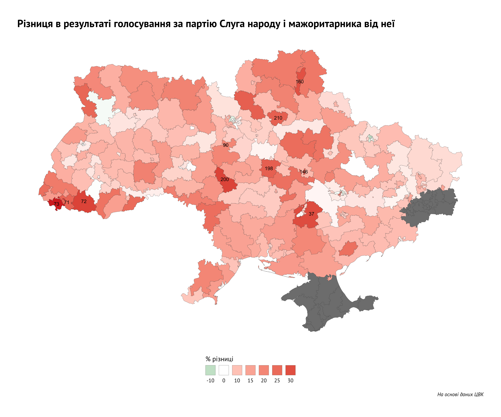

На цих парламентських виборах вперше в історії України одна з партій
перемогла в більшості округів. При цьому по справжньому “сильних”
мажоритарників у “Слуги народу” було мало, але партійний бренд був
настільки популярний, що свої округи взяли навіть весільні фотографи,
вчительки, тамада та інші не відомі широкому загалу особистості,
перемігши більш іменитих суперників.

Однак, як це не дивно, не на всіх округах популярність партії перетікала
у підтримку мажоритарного кандидата. Так, в середньому мажоритарний
кандидат від “Слуги народу” отримував десь на 10-11% менше голосів,
ніж партія на окрузі, однак в більшості випадків цього було достатньо
для перемоги. Тільки на 15 округах з 199 мадоритарник від “Слуги
народу” отримав більше, ніж партія на окрузі. При цьому 5 таких
округів знаходяться в Харкові, а 3 - в Києві (можливо, у великих
містах були більші можливості швидко “розрекламувати” саме
персоналії, а не тільки партійний бренд).

<!-- -->

Але були й округи, де “Слуга народу” не отримало свого мажоритарника
навіть попри підтримку партії в 40+%. На карті вище відмічено 10
окргугів, де різниця між підтримкою партії на окрузі і підтримкою
мажоритарника від “Слуги народу” була найбільшою (більше 25%).
Переможці в цих окргугах зробили майже неможливе, те, що не
вдалося навіть таким досвідченим мажоритарникам, як Володимир
Литвин чи Сергій Ківалов.

Хто ці люди?

<!--html_preserve-->

<!--gt table start-->

<table class="gt_table">

<thead>

<tr>

<th colspan="6" class="gt_heading gt_title gt_font_normal gt_center">

Топ-10 мажоритарників, які перемогли в округах попри сильну підтримку
партії Слуга
народу

</th>

</tr>

<tr>

<th colspan="6" class="gt_heading gt_subtitle gt_font_normal gt_center gt_bottom_border">

</th>

</tr>

</thead>

<tr>

<th class="gt_col_heading gt_right" rowspan="1" colspan="1">

\#

</th>

<th class="gt_col_heading gt_left" rowspan="1" colspan="1">

Переможець округу

</th>

<th class="gt_col_heading gt_right" rowspan="1" colspan="1">

Округ

</th>

<th class="gt_col_heading gt_right" rowspan="1" colspan="1">

Результат мажоритарника від Слуги народу

</th>

<th class="gt_col_heading gt_right" rowspan="1" colspan="1">

Результат партії Слуга народу

</th>

<th class="gt_col_heading gt_right" rowspan="1" colspan="1">

Різниця в результаті партії і
мажоритарника

</th>

</tr>

<tbody class="gt_table_body">

<tr>

<td class="gt_row gt_right" style="background-color:white;">

</td>

<td class="gt_row gt_left" style="background-color:white;">

Поляк Владіслав Миколайович
(самовисування)

</td>

<td class="gt_row gt_right" style="background-color:white;">

73

</td>

<td class="gt_row gt_right" style="background-color:#F2E1B5;color:#000000FF;">

12.34%

</td>

<td class="gt_row gt_right" style="background-color:#C48772;color:#000000FF;">

50.6%

</td>

<td class="gt_row gt_right" style="background-color:#D4A487;color:#000000FF;">

38.26%

</td>

</tr>

<tr>

<td class="gt_row gt_right gt_striped" style="background-color:white;">

</td>

<td class="gt_row gt_left gt_striped" style="background-color:white;">

Петьовка Василь Васильович
(самовисування)

</td>

<td class="gt_row gt_right gt_striped" style="background-color:white;">

72

</td>

<td class="gt_row gt_right gt_striped" style="background-color:#E5C7A2;color:#000000FF;">

23.18%

</td>

<td class="gt_row gt_right gt_striped" style="background-color:#BE7D6A;color:#000000FF;">

55.19%

</td>

<td class="gt_row gt_right gt_striped" style="background-color:#DBB292;color:#000000FF;">

32.01%

</td>

</tr>

<tr>

<td class="gt_row gt_right" style="background-color:white;">

</td>

<td class="gt_row gt_left" style="background-color:white;">

Яценко Антон Володимирович
(самовисування)

</td>

<td class="gt_row gt_right" style="background-color:white;">

200

</td>

<td class="gt_row gt_right" style="background-color:#EFDAB0;color:#000000FF;">

15.13%

</td>

<td class="gt_row gt_right" style="background-color:#C98F78;color:#000000FF;">

47.14%

</td>

<td class="gt_row gt_right" style="background-color:#DBB292;color:#000000FF;">

32.01%

</td>

</tr>

<tr>

<td class="gt_row gt_right gt_striped" style="background-color:white;">

</td>

<td class="gt_row gt_left gt_striped" style="background-color:white;">

Шпенов Дмитро Юрійович
(самовисування)

</td>

<td class="gt_row gt_right gt_striped" style="background-color:white;">

37

</td>

<td class="gt_row gt_right gt_striped" style="background-color:#DAB090;color:#000000FF;">

33.01%

</td>

<td class="gt_row gt_right gt_striped" style="background-color:#B46A5D;color:#000000FF;">

63.44%

</td>

<td class="gt_row gt_right gt_striped" style="background-color:#DDB695;color:#000000FF;">

30.43%

</td>

</tr>

<tr>

<td class="gt_row gt_right" style="background-color:white;">

</td>

<td class="gt_row gt_left" style="background-color:white;">

Молоток Ігор Федорович
(самовисування)

</td>

<td class="gt_row gt_right" style="background-color:white;">

160

</td>

<td class="gt_row gt_right" style="background-color:#E6C9A3;color:#000000FF;">

22.31%

</td>

<td class="gt_row gt_right" style="background-color:#C38470;color:#000000FF;">

51.99%

</td>

<td class="gt_row gt_right" style="background-color:#DEB896;color:#000000FF;">

29.69%

</td>

</tr>

<tr>

<td class="gt_row gt_right gt_striped" style="background-color:white;">

</td>

<td class="gt_row gt_left gt_striped" style="background-color:white;">

Шаповалов Юрій Анатолійович
(самовисування)

</td>

<td class="gt_row gt_right gt_striped" style="background-color:white;">

146

</td>

<td class="gt_row gt_right gt_striped" style="background-color:#E5C7A1;color:#000000FF;">

23.27%

</td>

<td class="gt_row gt_right gt_striped" style="background-color:#C58872;color:#000000FF;">

50.27%

</td>

<td class="gt_row gt_right gt_striped" style="background-color:#E1BE9B;color:#000000FF;">

27.01%

</td>

</tr>

<tr>

<td class="gt_row gt_right" style="background-color:white;">

</td>

<td class="gt_row gt_left" style="background-color:white;">

Коровченко Сергій Володимирович
(самовисування)

</td>

<td class="gt_row gt_right" style="background-color:white;">

210

</td>

<td class="gt_row gt_right" style="background-color:#ECD6AC;color:#000000FF;">

17.09%

</td>

<td class="gt_row gt_right" style="background-color:#CD967D;color:#000000FF;">

44.05%

</td>

<td class="gt_row gt_right" style="background-color:#E1BE9B;color:#000000FF;">

26.96%

</td>

</tr>

<tr>

<td class="gt_row gt_right gt_striped" style="background-color:white;">

</td>

<td class="gt_row gt_left gt_striped" style="background-color:white;">

Рудик Сергій Ярославович
(самовисування)

</td>

<td class="gt_row gt_right gt_striped" style="background-color:white;">

198

</td>

<td class="gt_row gt_right gt_striped" style="background-color:#E1BD9A;color:#000000FF;">

27.37%

</td>

<td class="gt_row gt_right gt_striped" style="background-color:#C07F6C;color:#000000FF;">

54.3%

</td>

<td class="gt_row gt_right gt_striped" style="background-color:#E1BE9B;color:#000000FF;">

26.93%

</td>

</tr>

<tr>

<td class="gt_row gt_right" style="background-color:white;">

</td>

<td class="gt_row gt_left" style="background-color:white;">

Лунченко Валерій Валерійович
(самовисування)

</td>

<td class="gt_row gt_right" style="background-color:white;">

71

</td>

<td class="gt_row gt_right" style="background-color:#E0BB99;color:#000000FF;">

28.14%

</td>

<td class="gt_row gt_right" style="background-color:#C07F6C;color:#000000FF;">

54.15%

</td>

<td class="gt_row gt_right" style="background-color:#E2C19C;color:#000000FF;">

26.01%

</td>

</tr>

<tr>

<td class="gt_row gt_right gt_striped" style="background-color:white;">

</td>

<td class="gt_row gt_left gt_striped" style="background-color:white;">

Бабенко Микола Вікторович (Політична Партія “Біла Церква
разом”)

</td>

<td class="gt_row gt_right gt_striped" style="background-color:white;">

90

</td>

<td class="gt_row gt_right gt_striped" style="background-color:#EED8AE;color:#000000FF;">

16.01%

</td>

<td class="gt_row gt_right gt_striped" style="background-color:#CF9B81;color:#000000FF;">

41.92%

</td>

<td class="gt_row gt_right gt_striped" style="background-color:#E2C19D;color:#000000FF;">

25.91%

</td>

</tr>

</tbody>

<tfoot>

<tr>

<td colspan="7" class="gt_sourcenote">

За даними сайту ЦВК (без врахування спецдільниць)

</td>

</tr>

</tfoot>

</table>

<!--gt table end-->

<!--/html_preserve-->

Відмітимо в першу чергу регіональну особливість. Троє з учасників топу -
мажоритарники із Закарпаття. При цьому тільки один із цих трьох (Василь
Петьовка) є частиною клану Балог, які стабільно обираються в Раду з
округів Закарпаття. Владіслав Поляк, що є лідером нашого рейтингу,
взагалі вперше обриається до Верховної ради. До цього він був тільки
депутатом Виноградівської міської ради від Партії регіонів та
депутатом Закарпатської обласної ради від Відродження. Третій
представник Закарпаття у цьому списку Лунченко Валерій був депутатом
парламенту попереднього скликання від Народного фронту, до цього був
депутатом від Батьківщини. Висування як безпартійний самовисуванець та
тривалий досвід роботи в Закарпатті (був депутатом Хустської міськради,
Закарпатської облради та головою Закарпатської ОДА) допомогли йому
перемогти на окрузі.

У нашому топі є два мажоритарники з Черкащини. Антон Яценко виграв 200
округ дуже впевнено (тільки три кандидати виграли свої округи з
підтримкою більше 60%, Яценко - один із них). Це не перша його
перемога в цьому окрузі, у попереднє скликання він пройшов по ньому
ж. Цьому не завадила його неоднозначна політична біографія, яка включає
в себе його неодноразові переходи між різними політичними силами. В
останньому скликанні він був членом депутатської групи
“Відродження”. Сергій Рудик, який переміг по 198 округу,
теж не відрізняється політичною відданістю, бо на минулих виборах
переміг у цьому окрузі як член ВО “Свобода”, але в 2015 вийшов з
неї і потім приєднався до Блоку Петра Порошенка. Його перевага над
кандидатом від “Слуги народу” склала близько 1000 голосів, при цьому
“клон” відібрав у першого 1300.

Шпенов Дмитро - мажоритарник, який виграв округ, де у “Слуги народу”
підтримка більше 60%\! Виграв, щоправда, не без використання
двійників проти основного конкурента (за даними ОПОРИ, таких на
окрузі проти справжнього кандидата від “Слуги народу” було використано
цілих 5\! + одна з осіб, яка висувалася, мала таке саме прізвище,
сумарно ці всі особи зібрали близько 10000 голосів). Хоч і
балотувався він як самовисуванець, але у 8 скликанні він був
членом Опоблоку, до того ж, ще раніше був помічений у якості
помічника Олександра Вілкула та члена Партії регіонів. В окрузі
перемагає третій раз підряд.

Ігор Молоток з 160 округу на Сумщині теж третій раз раз перемогає на
своєму окрузі. Завжди обирався як безпартійний самовисуванець, але
потім вступав, то в Партію регіонів, то у Волю народу.

Юрій Шаповалов - ще один щасливчик, який скористався “клонами” кандидата
від Слуги народу (таких на окрузі було 4). Сумарно ці кандидати
відібрали у головного конкурента близько 3000 голосів - якраз
рівно стільки не вистачило кандидату від “Слуги народу” для перемоги.
В іншому біографія Шаповалова ідентична до біографії Ігора Молотка -
3-чі обраний за тим самим округом як безпартійний висуванець. Був
членом Партії регіонів, Волі народу та Відродження.

А от для Сергія Коровченка перемога на окрузі перша в житті. Висувався
як самовисуванець, однак є члеом партії “Батьківщина”. Його перемога
теж стала можливою через наявність у “Слуга народу” клонів. Два клони
відібрали в кандидата від уже партії-влади близько 4500 голосів. З цими
голосами округ мав би іншого переможця.

Єдиний висуванець від партії у цьому списку - мажоритарник від “Біла
церква разом” Микола Бабенко. Певні життєві обставини змусили його
відмовитись від асоціації із тими політичиними брендами, під якими він
обирався в парламент попередні два рази - УДАР та Блок Петра Порошенка
(можливо, те, що він з ними не зміг виграти округ). Така ставка на
білоцеркіський патріотизм виявилася успішною і в окрузі він виграв
без використання послуг двійників “Слуги народу”.

Як бачимо, перемогти в окрузі дуже потужний партійний бренд можливо по
суті тільки двома способами: дуже давно працювати в окрузі і стати
“своїм” для його жителів (і при цьому не набриднути), або ж
“знищити” свого конкурента за допомогою його клонів. Але і ці
способи дають результат тільки проти маловідомих висуванців, бо,
наприклад, Ігорю Кононенко проти Олександра Дубінського це все не
допомогло.
